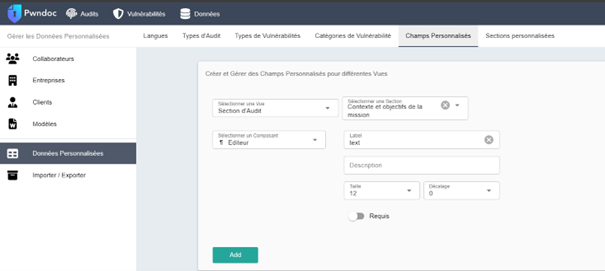

# Guide de Configuration et Utilisation

## Introduction
Ce repository GitHub explique comment utiliser un **template préconfiguré** avec une **macro intégrée** pour rectifier automatiquement la mise en page des documents d'audit. 
Il détaille également la configuration de **PwnDoc** afin d'intégrer ce template et de faciliter la rédaction de rapports personnalisés, tout en respectant une structure bien définie.

Pour des informations complémentaires, consultez la [documentation officielle de PwnDoc](https://pwndoc.github.io/pwndoc/#/docxtemplate).

---

## Étapes de Configuration

### 1. Création d’un Modèle
1. Naviguez vers **Données > Modèles**.
2. Créez un nouveau modèle.
3. Importez le Template et créez le modèle.
   

---

### 2. Configuration des Sections Personnalisées
1. Accédez à **Données > Données Personnalisées > Sections Personnalisées**.
2. Créez les sections suivantes en respectant les champs :

| **Nom**                               | **Champs**                |
|---------------------------------------|---------------------------|
| Contexte et objectifs de la mission   | `contexte`               |
| Périmètre de la mission               | `perimettre`             |
| Méthodologie                          | `methodologie_`          |
| Limites de la mission                 | `limites`                |
| Remise en état                        | `remise_etat`            |
| Synthèse managériale                  | `synthese_manageriale_`  |
| Recommandations de remédiations       | `remediations`           |

   
   

---

### 3. Configuration des Champs Personnalisés
1. Accédez à **Données > Données Personnalisées > Champs Personnalisés**.
2. Sélectionnez **Section d’Audit**, puis choisissez une section.
3. Sélectionnez **Éditeur**, et saisissez `text` dans le champ **Label**.
4. Validez en cliquant sur **Add**.
   

---

### 4. Création des Types d’Audit
1. Accédez à **Données > Données Personnalisées > Types d’Audit**.
2. Donnez un nom à votre type d’audit.
3. Sélectionnez le modèle correspondant.
4. Ajoutez les sections nécessaires.
   

---

### 5. Création d’un Audit
1. Accédez à **Audits**.
2. Créez un nouvel audit en :
   - Sélectionnant le type d’audit souhaité.
   - Choisissant la langue.
   

---

## Insertion des Vulnérabilités

1. **Désactivation du Tri Automatique** :
   - Les vulnérabilités doivent être insérées sans leur attribuer de type pour garantir un tri manuel.
   

2. **Classement des Vulnérabilités** :
   - Insérez-les dans cet ordre :  
     - **Critique**  
     - **Haute**  
     - **Moyenne**  
     - **Basse**

---

## Utilisation des Macros de Mise en Page

1. **Activation du Mode Développeur** :
   - Activez le mode développeur pour utiliser les macros du template.
   - Si un message d’erreur apparaît :
     1. Faites un clic droit sur le fichier.
     2. Sélectionnez **Paramètres**.
     3. Cochez « Débloquer ».
     
     

2. **Effets des Macros** :
   - Texte justifié et mise en page des tableaux :
     - Avant :
       
       
     - Après :
       
       

---

## Problèmes Standards

- Les balises doivent être correctement colorisées et respecter strictement le format.
  
- Attention aux espaces supplémentaires et tabulations incorrectes.
- Les paramètres des champs doivent correspondre exactement à ceux du Template.
  

---

## Gestion du Sommaire

Une erreur courante se produit lorsque le sommaire est mis à jour sur le template avant l’import dans PwnDoc.  
Cette ligne met PwnDoc en défaut :  
```
III.1. {identifier | changeID: 'V'} : {title} 10
```
Il suffit de la supprimer pour résoudre l’erreur.  


---

## Remarques Importantes

- Testez la configuration des audits et l’édition avant de commencer à rédiger un rapport.
- Les modifications des sections ne s’appliquent pas aux audits déjà créés.

---

Pour plus de détails, visitez la [documentation officielle](https://pwndoc.github.io/pwndoc/#/docxtemplate).

---
